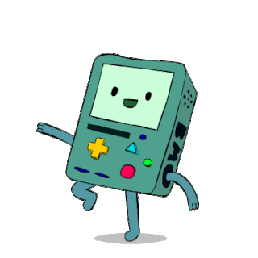

 

---

<h1 align="center"> 🐱‍💻 Aʙᴏᴜᴛ Mᴇ</h1>

 

Check it out, I'm a Computer Systems Engineer, always hungry for knowledge and keen on applying it across tech realms. I've nailed it with GPS systems and APIs for transport – innovation's my game, and problem-solving's my jam.

What sets me apart? I'm a DIY tech wizard with a mind wired for Asperger's and an epic knack for soaking up info. I breeze through code like a boss, smashing through any learning curve that gets in my way.

I'm all about that teamwork, but I shine brightest when I've got the reins. Efficiency and top-notch code are my trademarks.

Currently on the lookout for remote gigs that push the boundaries and welcome fresh, unconventional ideas. Got a wild project? I'm all ears and ready to dive in!

Hit me up, let's make magic together!

---

<h2  align="center">Lᴀɴɢᴜᴀᴊᴇs Aɴᴅ Tᴏᴏʟs</h2>

---

<h2 align="center">Tʜᴏᴜɢʜᴛ Oғ Tʜᴇ Dᴀʏ</h2>

<!--STARTS_QUOTE_CARD-->

<!--ENDS_QUOTE_CARD-->
 

  

